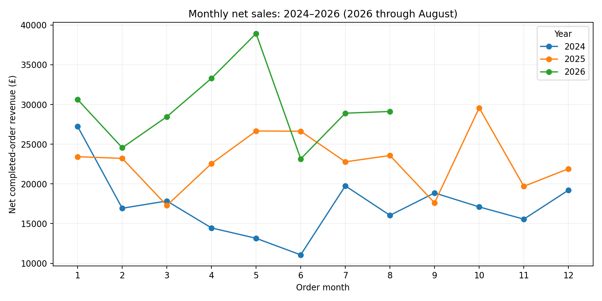
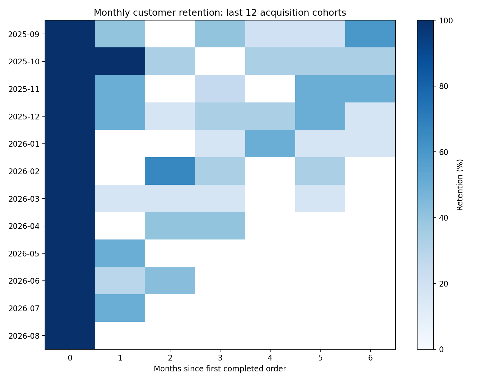
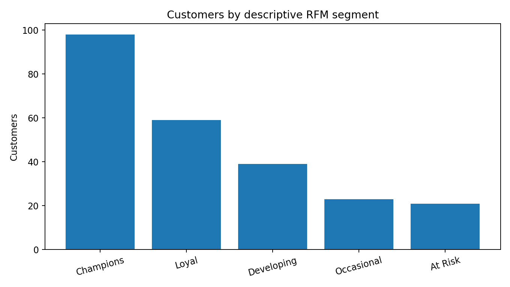

# E-commerce Customer & Sales Analysis | Python

**Python • pandas • Data cleaning • RFM segmentation • Cohort analysis • Matplotlib**

## Project overview

This project analyses a synthetic UK e-commerce dataset covering **2024, 2025 and January–August 2026**. It combines customer, product, order and order-item data to produce sales KPIs, customer segments, retention analysis and business insights.

## Business questions

- How are revenue, gross profit and gross margin changing over time?
- Which categories and regions generate the most revenue?
- Which customers are the most valuable?
- Which customers show signs of becoming inactive?
- How strong is repeat purchasing across customer cohorts?
- Are the source datasets complete and consistent?

## Analytical approach

The analysis uses `pandas` to clean, validate and join four related datasets. Duplicate records, missing values, invalid dates and invalid order-line values are identified and handled before analysis.

Completed orders contribute to sales KPIs. Customer behaviour is analysed using **RFM (Recency, Frequency, Monetary)** segmentation and monthly cohort retention.

## Sales performance

| Period | Completed orders | Active customers | Net revenue | Gross profit | Gross margin |
|---|---:|---:|---:|---:|---:|
| 2024 | 540 | 133 | £207,202.75 | £64,342.75 | 31.05% |
| 2025 | 718 | 195 | £274,915.90 | £86,228.90 | 31.37% |
| 2026 Jan–Aug | 590 | 225 | £237,060.05 | £74,447.05 | 31.40% |

**January–August revenue comparison:** 2024 **£136,475.25** · 2025 **£186,125.70** · 2026 **£237,060.05**

## Customer insights

- **Electronics** generated **£478,682.75** in net revenue across the analysed period.
- **South** was the highest-revenue recorded region at **£239,598.95**.
- RFM segmentation identified **98 Champions** and **21 At Risk** customers.
- Cohort analysis tracks repeat purchasing by month after each customer's first observed completed order.

## Python techniques demonstrated

- Data cleaning and validation
- `pandas` joins and transformations
- Grouping and aggregation
- Date handling
- KPI calculation
- RFM customer segmentation
- Cohort retention analysis
- Data-quality auditing
- Matplotlib visualisation
- Exporting analysis results to CSV

## Repository contents

| File | Description |
|---|---|
| [Python_Customer_Sales_Analysis.ipynb](Python_Customer_Sales_Analysis.ipynb) | Complete analysis notebook |
| [analysis.py](analysis.py) | Python analysis pipeline |
| [generate_sample_data.py](generate_sample_data.py) | Dataset generation script |
| `raw_*.csv` | Source datasets |
| `result_*.csv` | Analysis outputs |
| `chart_*.png` | Analytical charts |
| [DATA_DICTIONARY.md](DATA_DICTIONARY.md) | Data dictionary |
| [requirements.txt](requirements.txt) | Python dependencies |

## Tools

**Python · pandas · NumPy · Matplotlib · Jupyter Notebook**
